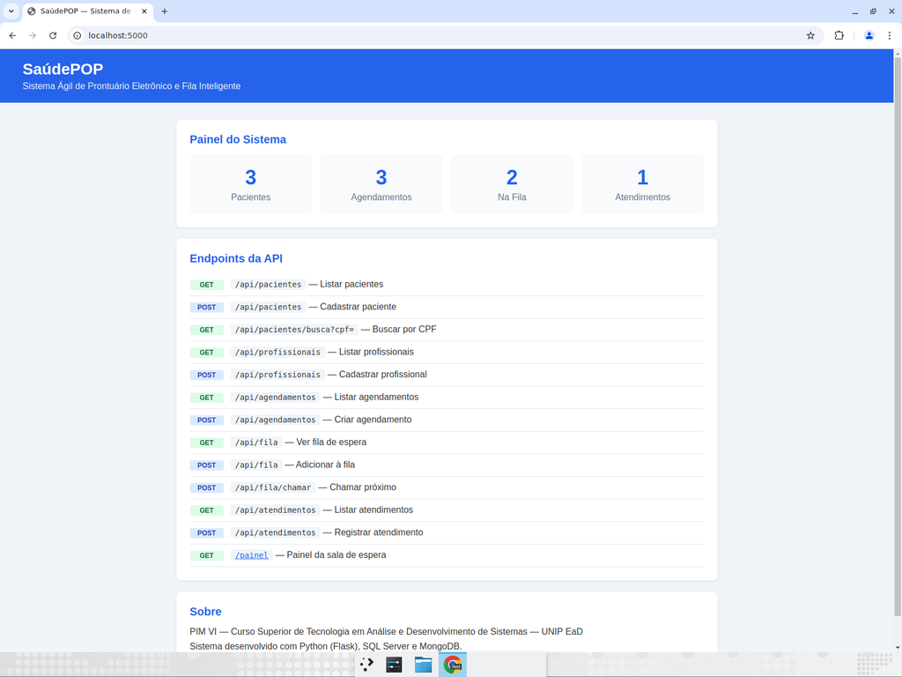
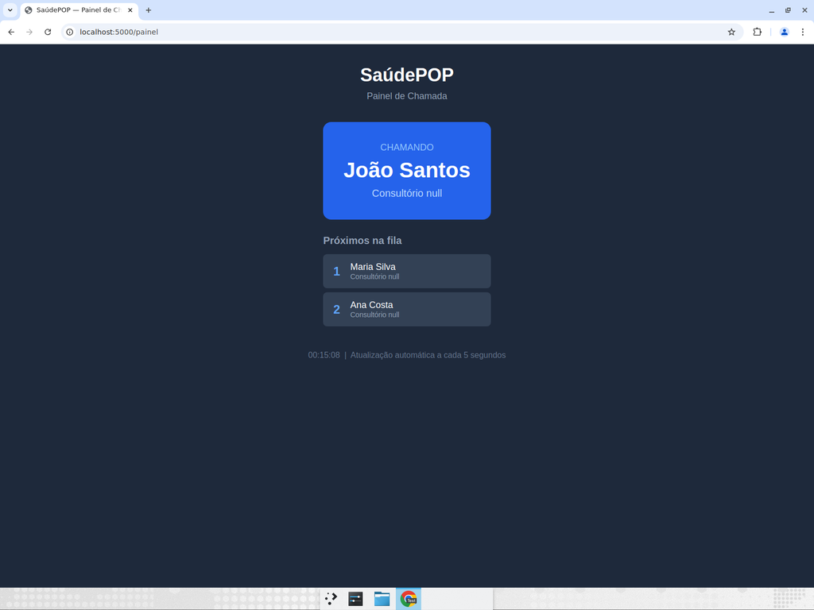

# Protótipo Navegável — SaúdePOP

## Descrição

O protótipo navegável do SaúdePOP foi desenvolvido como uma aplicação web funcional em Python (Flask), permitindo a validação dos fluxos de interação descritos nos wireframes e jornadas do usuário. As capturas de tela abaixo demonstram as telas implementadas e os fluxos de navegação.

> **Nota**: Para um projeto acadêmico completo, recomenda-se reproduzir estes fluxos também em uma ferramenta de prototipagem como o Figma, permitindo simulação de interações sem necessidade de código.

---

## Tela 1 — Dashboard Principal (Painel da Recepção)



**URL**: `http://localhost:5000`

**Descrição do fluxo**:
- Ao acessar o sistema, o usuário visualiza o **Painel do Sistema** com contadores em tempo real de pacientes cadastrados, agendamentos, pacientes na fila e atendimentos realizados.
- Abaixo, são listados todos os **endpoints da API** disponíveis, com indicação do método HTTP (GET/POST) e a descrição da funcionalidade.
- O link `/painel` direciona para o Painel de Chamada da sala de espera.

**Princípios aplicados**:
- Hierarquia visual: contadores grandes no topo para visão rápida do estado da clínica
- Cores: verde (GET) e azul (POST) para diferenciar tipos de operação
- Tipografia clara com fonte sans-serif

---

## Tela 2 — Painel de Chamada (Sala de Espera)



**URL**: `http://localhost:5000/painel`

**Descrição do fluxo**:
- Esta tela é projetada para exibição em um **monitor/TV na sala de espera**, sem necessidade de interação.
- O paciente atualmente sendo chamado aparece em **destaque** com fundo azul e fonte grande.
- Abaixo, a lista dos **próximos pacientes** na fila é exibida em ordem.
- A tela é atualizada automaticamente a cada **5 segundos** via JavaScript (fetch API).
- Fundo escuro com texto claro para **alta legibilidade à distância**.

**Princípios aplicados**:
- Contraste elevado (fundo escuro, texto branco) para legibilidade em salas iluminadas
- Fonte de tamanho grande para leitura a até 5 metros de distância
- Atualização automática elimina necessidade de interação manual
- Acessibilidade: contraste WCAG AAA (>7:1)

---

## Fluxo 1 — Cadastro de Paciente (Recepcionista)

**Fluxo de navegação**: Dashboard → POST /api/pacientes

**Dados enviados** (JSON):
```json
{
  "nome": "Maria Silva",
  "cpf": "123.456.789-00",
  "data_nascimento": "1985-03-15",
  "telefone": "(11) 99999-0001",
  "email": "maria@email.com"
}
```

**Resposta do sistema**:
```json
{
  "id_paciente": 1,
  "nome": "Maria Silva",
  "cpf": "123.456.789-00",
  "created_at": "2026-05-20T00:08:56"
}
```

**Validações implementadas**:
- CPF é obrigatório e único (sistema rejeita duplicatas com erro 409)
- Campos opcionais: telefone, email, endereço

---

## Fluxo 2 — Agendamento de Consulta (Recepcionista)

**Fluxo de navegação**: Dashboard → POST /api/agendamentos

**Dados enviados**:
```json
{
  "id_paciente": 1,
  "id_profissional": 1,
  "data_hora": "2026-05-20 14:00",
  "tipo": "Consulta"
}
```

**Validações implementadas**:
- Detecção de conflito de horário (rejeita se o mesmo profissional já tem consulta naquele horário)
- Status inicial: "agendado"

---

## Fluxo 3 — Gestão da Fila de Espera (Recepcionista)

**Fluxo de navegação**: Dashboard → POST /api/fila → POST /api/fila/chamar

**Adicionar à fila**:
```json
{
  "id_paciente": 1,
  "prioridade": "prioritario",
  "tipo_atendimento": "Consulta"
}
```

**Prioridades implementadas**:
| Prioridade | Peso | Descrição |
|---|---|---|
| `emergencia` | 3 | Emergências médicas |
| `prioritario` | 2 | Idosos, gestantes, lactantes, PCDs |
| `normal` | 1 | Atendimento regular |

**Chamar próximo**: O sistema automaticamente chama o paciente com maior prioridade. Pacientes prioritários são chamados antes, independente da ordem de chegada.

---

## Fluxo 4 — Registro de Atendimento (Médico)

**Fluxo de navegação**: Dashboard → POST /api/atendimentos

**Dados enviados**:
```json
{
  "id_paciente": 1,
  "id_profissional": 1,
  "queixa": "Dor de cabeça frequente",
  "diagnostico": "Cefaleia tensional",
  "prescricao": "Dipirona 500mg - 6/6h",
  "observacoes": "Retorno em 30 dias"
}
```

**Dados registrados automaticamente**:
- Data/hora de início do atendimento
- Vinculação com paciente e profissional

---

## Fluxo 5 — Consulta de Histórico (Paciente/Médico)

**Fluxo de navegação**: Dashboard → GET /api/pacientes/busca?cpf=123.456.789-00 → GET /api/atendimentos

**Descrição**: O médico ou recepcionista localiza o paciente por CPF e acessa todo o histórico de atendimentos, incluindo diagnósticos, prescrições e observações anteriores. Isso elimina a necessidade de prontuários em papel e garante a continuidade do cuidado.

---

## Resumo dos Princípios de Design

| Princípio | Aplicação no Protótipo |
|---|---|
| **Hierarquia visual** | Contadores no topo do dashboard; nome do paciente chamado em destaque no painel |
| **Tipografia** | Fonte sans-serif (padrão do navegador); tamanhos diferenciados para títulos e corpo |
| **Contraste** | Fundo escuro no painel de fila (WCAG AAA); fundo claro no dashboard (WCAG AA) |
| **Acessibilidade** | Fonte grande no painel de espera; botões de tamanho mínimo 44px; cores com contraste suficiente |
| **Consistência** | Mesmo padrão de cores (azul primário) e layout em todas as telas |
| **Feedback** | Respostas JSON com dados criados; códigos de status HTTP (201, 400, 404, 409) |
